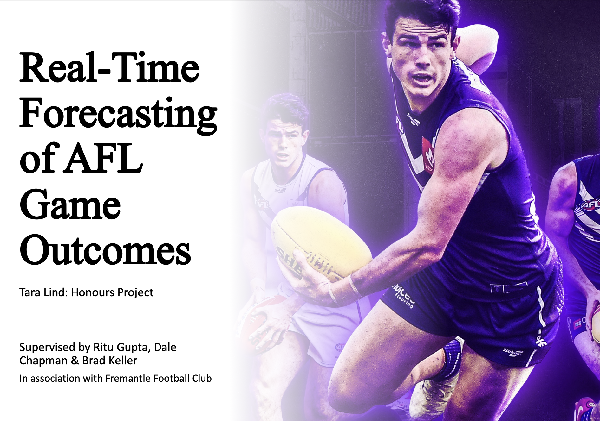
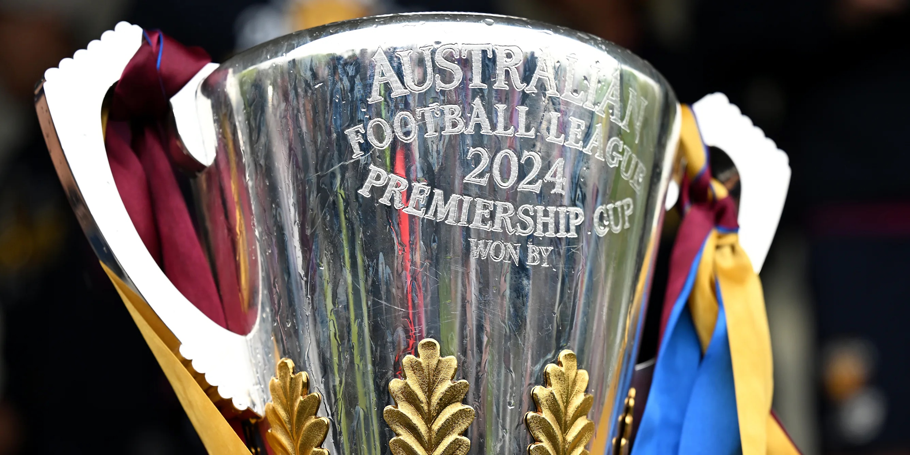
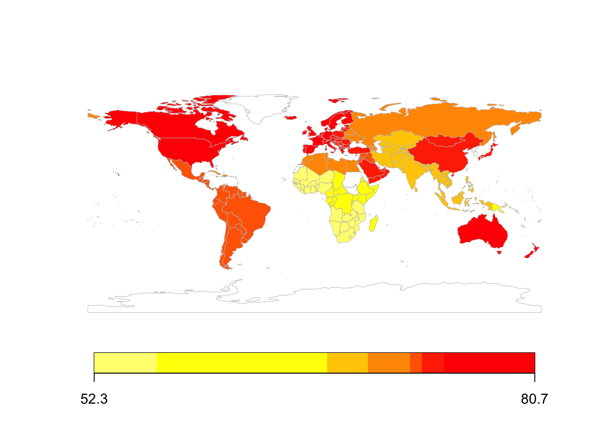

+++
date = '2026-03-01T13:28:03+11:00'
draft = false
title = 'Projects'
+++

These are selected projects I've done outside of my PhD project. 

## Tools

[Athletics results scraper](https://github.com/taralind/tilastopaja-trial-scraper)     
*code to scrape individual athlete trial data from multi-trial athletics events*

[Shotgun results scraper](https://github.com/taralind/issf-shotgun-scraper)       
*code to scrape shot-by-shot shooting competition results from the ISSF website* 

[Tutorial on Bayesian updating](https://github.com/taralind/bayesian-updating-tutorial)      
*tutorial for performing Bayesian updating with Bayes factors for sample size estimation in research studies*

## Analyses

  
  

    <a href="TaraLindHonoursSeminar.pdf" target="_blank">
      Real-time AFL game outcome prediction
    </a>
    
developed an accurate Markov model to predict AFL game outcomes continuously during a game using gameplay and score-based variables, identified “critical periods” marked by large late-game probability shifts, and documented the work in an Honours dissertation.

    

      R
      machine learning
    

  

  
  

    <a href="https://theconversation.com/we-simulated-the-upcoming-afl-season-four-different-ways-heres-what-was-predicted-249475">AFL 2025 Season Simulation</a>
    
simulated 2025 fixture 10,000 times to produce probabilistic predicted ladders, and communicated method and results to lay audiences

    

      R
      simulation
    

  

  
  

    <a href="https://medium.com/@taralind37/was-the-2023-fifa-womens-world-cup-the-most-competitive-yet-26b7c77202e7">FIFA 2023 Women’s World Cup EDA</a>
    
scraped diverse data (e.g. historic match outcomes, betting odds), developed metrics to quantify competitiveness, and presented evidence for increased competitiveness in subsequent women's fifa world cups

    

      python
      web scraping
      data wrangling
    

  

  
  

    <a href="https://rpubs.com/taralind/lifeexpectancy">Life Expectancy Prediction</a>
    
applied regression and random forest models to predict national life expectancies, determined key contributing factors, and proposed interventions to policy makers

    

      R
      machine learning
    

  

  
  

    <a href="https://github.com/taralind/diskgalaxy_kstest/blob/main/kstest.ipynb">Statistical Analysis of Disk-Hosting Radio Galaxies</a>
    
fused large catalogs (+300k observations) of galaxy clusters and radio sources to detect a certain rare type of galaxy, performed statistical tests to compare different galaxy groups, and calculated physical properties of galaxies (with python and bespoke astrophysics software)

    

      python
      statistical tests
      data wrangling
    

  

<!-- -
Basketball shooter problem
Modelled distributions
 -->
